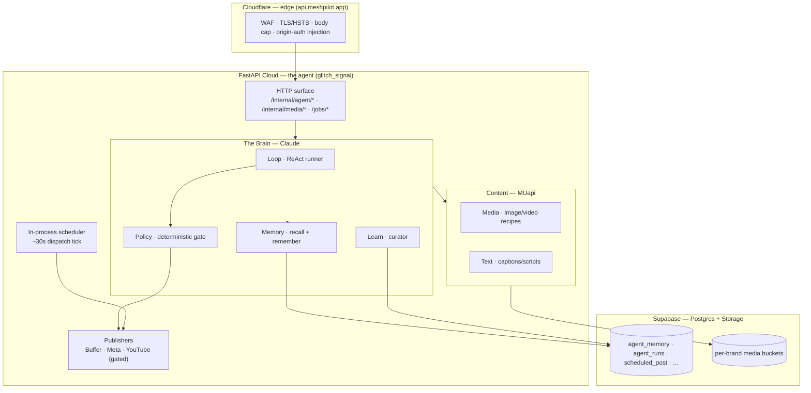
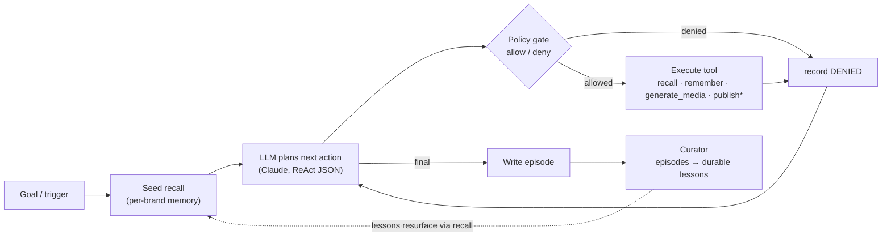

# Mesh Pilot — Autonomous Marketing Agent

> **One digital worker, not a mesh of six.** A single cloud-hosted agent with
> memory, judgment, its own tools, and a learning loop — built to run
> **autonomously, 24/7, on the cloud**. It perceives its brands' state, decides
> what to do, acts through its own capabilities, remembers what happened, and
> gets *better on its own* as it runs. No cockpit, no six-agent mesh, no SaaS
> surface. Just the worker.

Private repo. Live, headless, at **`api.meshpilot.app`** (FastAPI Cloud). No
frontend to the agent itself — the service *is* the agent: HTTP endpoints, an
in-process scheduler, and a cognitive loop are how it acts.

---

## Why this repo exists (and why we ditched the last one)

The predecessor — the **Mesh Pilot monorepo** (`meshpilot-digital-marketing-stack`,
our reference "bible") — tried to be everything at once: **six specialist agents**
(Ads, Sales, Social, Voice, SEO, UGC) wired into a mesh, sitting underneath a full
**SaaS product** — an operator cockpit, approval/audit control plane, a data
warehouse, a BYO-MCP acquisition funnel, plan tiers and billing.

It was impressive, and it was **too much**. Every capability multiplied against
every other; the SaaS surface multiplied against every agent; the coordination
cost grew faster than the value. We were building six agents *and* a company
around them before a **single** agent could stand on its own and work unattended.
The complexity, not the idea, is what stalled it.

**This repo is the correction.** We threw out the mesh and the SaaS scaffolding
and kept exactly one goal:

> **Build a digital AGI robot — one autonomous agent — that works 24/7 on the
> cloud.**

One process. One clear substrate: memory, a reasoning loop, a policy gate, a
learning curator, and a growing set of tools. Everything the monorepo proved is
still valuable — we **pull the proven logic and adapt it** (the bible pattern),
but we never inherit its *shape*. Scope is a feature. When a choice is unclear,
the simpler thing that keeps one agent autonomous wins.

---

## What it is (the 60-second version)

Most "AI marketing" tools are a chat box bolted onto an API. This is the opposite:
a **standing autonomous worker** that runs whether or not anyone is watching.

- It holds **per-brand memory** (durable facts + episodes of what it did).
- It runs a **reasoning loop** that recalls context, plans, and calls its
  **tools** — generate media, read/write memory, publish (gated) — then records
  what happened.
- A **deterministic policy gate** sits in front of every tool: unsafe actions are
  refused before they run (publishing is off until deliberately enabled).
- A **curator** distills its episodes into durable lessons, so the next run starts
  smarter. The loop closes: *act → remember → learn → act better.*

It is **multi-brand from day one** (Projects × Capabilities, below) and **cloud-only** —
nothing runs from a developer's Mac; the Mac edits code, commits, and triggers
deploys. The agent lives in the deployed service.

---

## How it works (the architecture)

Two model backends, split by job. **Claude** is the agent's *brain* (fast,
synchronous, multi-step reasoning). **MUapi** is its *content factory* (one
gateway for text, image, and video generation). The agent never confuses the two.



### The autonomous loop

This is the heart — what runs per brand, unattended. Publishing is a gated tool;
memory and learning are always-on.



Two things make it safe to leave running: **(1)** every tool call passes the
policy gate first (publish tools denied unless `agent_publish_enabled`, per-run
cost budgets on paid media); **(2)** background runs are persisted in Postgres
(`agent_runs`), so they survive the multi-worker cloud and are pollable by run id.

### The Brain (cognitive substrate)

Four increments, all live and verified:

- **MEM** — per-brand memory in Supabase (`agent_memory`): facts + episodes, hybrid
  recall (pgvector semantic + Postgres FTS, fused). `agent/memory/`.
- **LOOP** — a ReAct runner over **Claude** that recalls, plans, calls tools, and
  writes an episode; backgrounded + DB-backed for the cloud. `agent/loop/`.
- **POLICY** — a deterministic allow/deny gate run before every tool: per-brand
  denies, a **publish kill-switch**, and per-run media budgets. `agent/loop/policy.py`.
- **LEARN** — a Hermes-style curator that distills episodes into durable lessons
  (stored as facts, deduped, idempotent), closing the self-improvement loop.
  `agent/learn/curator.py`.

Patterns adapted from **Hermes** (memory-first + curator) and **OpenClaw**
(trusted-gateway / deterministic policy). See `docs/plans/2026-08-29-agent-brain.md`.

---

## Tech stack

| Layer | Technology | Notes |
|---|---|---|
| Language / runtime | **Python ≥ 3.11**, `uv` | one import root under `src/` |
| API framework | **FastAPI** (`fastapi[standard]`, uvicorn) | the agent's only control surface |
| Hosting | **FastAPI Cloud** | `api.meshpilot.app`; multi-worker |
| Edge / CDN | **Cloudflare** | WAF, TLS/HSTS, origin-auth; Pages for the web |
| Database | **Supabase Postgres** (asyncpg, SQLModel/SQLAlchemy) | `agent_memory`, `agent_runs`, `oauth_tokens`, … |
| Vectors | **pgvector** (`halfvec`, HNSW) | semantic recall in `agent_memory` |
| Object storage | **Supabase Storage** | per-brand media buckets (`<prefix>-media`) |
| Brain LLM | **Anthropic Claude** (Messages API) | the ReAct loop + curator |
| Embeddings | **NVIDIA NIM** (nemotron) | memory recall |
| Media — generate | **MUapi** (image/video/text) · **HeyGen** (avatar video, via MCP) · **Higgsfield** (Soul/DoP) | pluggable `Engine` protocol |
| Media — edit | **Pillow** | native deterministic `edit_image` |
| Agent framework | **custom ReAct loop** + **MCP client** (`mcp` SDK) | LangGraph for the legacy video pipeline |
| Publishing | **Buffer** · **Meta Graph API** · **YouTube** | gated OFF by policy |
| Web (waitlist) | **Next.js** (App Router, static export) → **Cloudflare Pages** | `web/`, `meshpilot.app` |
| Migrations | **Supabase-native SQL** | `supabase/migrations/*.sql` (Alembic retired) |
| CI/CD | **GitHub Actions** (drift-aware) | runs on push to `production` |
| Observability | **Logfire** · **Sentry** · **structlog** | |
| Secrets / auth | FastAPI Cloud env secrets · **Fernet** (token storage) · **OAuth 2.0** (HeyGen MCP) | per-brand `<PREFIX>_*`, no globals |

---

## Projects × Capabilities

The agent serves **many brands (projects) at once**, and gains **capabilities**
over time — the two axes are independent.

- **Projects** — each brings its *own* keys and infra (Meta app, Buffer token,
  Google service account, brand config). **No global credentials**: everything
  resolves per-brand as `<BRAND>_<KEY>` (e.g. `GE_META_APP_ID`). Glitch Executor
  (`GE`) is the first project.
- **Capabilities** — pluggable modules that own their routes, scheduler hooks, and
  config. **#1 — social publishing** (Buffer / Meta / YouTube) plus the media
  factory. Future: SEO, paid ads, email, analytics — each a module on the same
  agent, not a new agent.

---

## What runs right now (live state)

One deployable service on **FastAPI Cloud**, behind **Cloudflare**.

| Surface | What |
|---|---|
| `api.meshpilot.app` | The agent (custom domain, CF-proxied). Origin: `meshpilot-social-media-agent.fastapicloud.dev` |
| `/healthz` | Liveness (exempt from auth + rate limit) |
| `/internal/agent/{remember,recall,run,curate}` + `GET /internal/agent/run/{id}` | Brain: memory, backgrounded loop, curator (jobs-auth) |
| `/internal/media/{recipes,generate,ensure-bucket}` | MUapi media factory → per-brand Supabase buckets |
| `/internal/{buffer,facebook,instagram,youtube}/*` | Publisher test/introspection endpoints (gated) |
| `/jobs/{scout,drive_scout,assemble}` | Legacy LangGraph content pipeline (superseded by the brain; still live) |

- **LLM split:** Claude = brain (`ANTHROPIC_API_KEY`); MUapi = all content text +
  media (`MUAPI_API_KEY`). Vision QC is the one Claude-vision exception.
- **Data:** Supabase Postgres (project `qkztphfjwgluwwlgeyys`) + Storage buckets.
  Embeddings via NVIDIA NIM. **Publishing is OFF by default** (`agent_publish_enabled=False`).
- **Scheduler:** in-process ~30s tick; the same dispatch is endpoint-reachable, so
  an external cron can drive it if the host scales to zero.

---

## Repo layout

```
main.py                     FastAPI Cloud entrypoint → glitch_signal.server:app
src/glitch_signal/
  server.py                 FastAPI app + startup (installs middleware, starts scheduler)
  config.py                 pydantic-settings; all runtime config via env (per-brand <TAG>_*)
  agent/
    loop/                   BRAIN — ReAct runner, Claude llm, policy gate, tools, runs, prompt
    memory/                 BRAIN — per-brand facts+episodes, hybrid recall, NVIDIA embeddings
    learn/                  BRAIN — curator (episodes → durable lessons)
    llm.py                  CONTENT text shim → MUapi (retired the old LiteLLM router)
    graph.py nodes/         Legacy LangGraph video pipeline (superseded; QC on Claude vision)
  media/                    Media factory — recipes + pluggable engines (MUapi · HeyGen), storage
  webhooks/                 Provider callbacks (e.g. /webhooks/heygen — HMAC-verified)
  middleware/               CF hardening — security headers, body cap, origin-auth, rate limit
  platforms/ integrations/  Publisher clients (Buffer, Meta, YouTube, Drive/Sheets)
  scheduler/                Recurring dispatch tick loop
  sheet_posting/            Sheet-driven recurring posting
  db/  oauth/  crypto.py    SQLModel + async session; per-platform token storage (Fernet)
supabase/migrations/        Supabase-native SQL migrations (Alembic retired)
brand/                      Per-brand config templates (real values are env/secret)
web/                        Waitlist site (Next.js) — deployed separately via Cloudflare Pages
docs/                       Doc-driven workflow (start at docs/DOC-SYSTEM.md; north star docs/VISION.md)
control-plane/              ACTIVE_LANE_BOARD.md · SESSION_COORDINATION.md · ENGINEERING_SUPERVISOR.md
```

---

## Build & run

- **Python** ≥ 3.11, managed with `uv`.
- **Database:** external PostgreSQL (Supabase). Connection via `SIGNAL_DB_URL`
  (else `DATABASE_URL`); normalized to asyncpg, `ssl="require"`, pooler-safe
  (`statement_cache_size=0`).

```bash
uv sync
cp .env.example .env          # provider keys + SIGNAL_DB_URL (+ per-brand GE_* secrets)
uv run pytest -q              # the suite must be green before you ship
uv run fastapi dev main.py    # local run
```

---

## Deploy (FastAPI Cloud)

App id `0d017e5b-1834-4952-8a77-b68f83ff2bfc`, team `helpn8nworld` ("Mesh Pilot"),
region us-east-1.

- **Branch model — single trunk, no `main`/`preview`:**
  - **`production`** — the trunk **and** the API deploy branch (GitHub default).
    Lanes PR **into** it; merging auto-deploys the agent. Protected — never commit
    directly.
  - **`web-production`** — the `web/` waitlist site (Cloudflare Pages),
    fast-forwarded from `production`.
- **CI** runs **on push to `production`** (drift-aware): pytest on API drift, a
  Supabase-migration apply on DB drift, the Next build on `web/` drift.
- **Migrations** are Supabase-native (`supabase/migrations/*.sql`), applied by the
  Supabase↔GitHub integration on merge. **Additive migrations before code, removals
  after.**

```bash
# manual deploy from this dir (uses FASTAPI_CLOUD_TOKEN)
uvx --from "fastapi[standard]" fastapi cloud deploy .
```

**Runtime gotchas (learned the hard way — keep them):**
- **`fastapi[standard]`**, not bare `fastapi` — the cloud launches via the
  `fastapi run` CLI, which lives in that extra.
- **`greenlet`** must be an explicit dep (SQLAlchemy async needs it).
- **`env set` is create-only** for an existing var — delete then recreate to update.
- **Multi-worker:** never keep runtime state in an in-process dict — it isn't
  pollable across workers. Persist it (that's why background runs live in `agent_runs`).
- **Behind Cloudflare:** `/internal` + `/jobs` require the CF-injected `x-origin-auth`;
  a direct-to-origin call to those paths returns `403` **by design**.

---

## Git / hosting

Mirrored to two orgs for redundancy: **GitHub** `Nuraveda-Labs/…` and **GitLab**
`nuraveda-lab/…`. Push/fetch **SSH only** — never a token in a remote URL. Commits
are authored as *Tejas Karan Agrawal* and **SSH-signed**. Work happens on a **lane**
(`lane/*` off `production`), lands via **PR into `production`**, and the lane is
pruned both sides when done. Never commit on `production` or a `*-production` deploy
branch.

---

## Doc index (start points)

This is a **doc-driven** repo (vibe-coding-kit method). Before code, read in order:

| Doc | What it holds |
|---|---|
| `docs/VISION.md` | The north star — cloud agent, Projects × Capabilities, principles |
| `docs/DOC-SYSTEM.md` | The doc map + precedence |
| `control-plane/ACTIVE_LANE_BOARD.md` | The live lane queue |
| `docs/THE-METHOD.md` · `docs/ROLES.md` | How the multi-agent team works a lane |
| `docs/plans/2026-08-29-agent-brain.md` | The brain design (MEM · LOOP · POLICY · LEARN) |
| `docs/vendors/` | Cloudflare, FastAPI Cloud, MUapi, … runbooks |
| `ARCHITECTURE.md` | Original extraction design notes |

A lane isn't done until the contract docs are updated and evidence is appended to
`control-plane/ENGINEERING_SUPERVISOR.md`.
